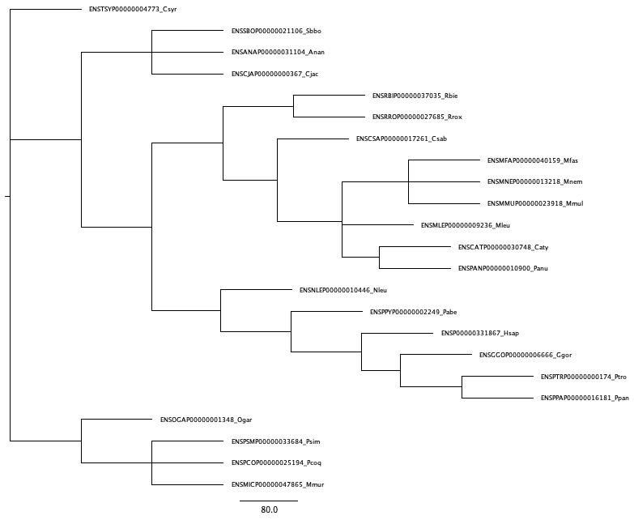

# INTRODUCTION/BACKGROUND/HYPOTHESES 
## The Hominin Lineage 
During hominin evolution, it is thought that the introduction of meat into 
the hominin diet provided a new, calorically rich food source that 
resulted in a higher daily caloric intake. This increased caloric 
availability may have facilitated hominin brain evolution, as human brains 
have intense energetic demands (~20-25% of resting metabolic rate) 
compared to the average primate (~9%) and the average mammal (~3-5%) 
(Leonard, 2007). Additionally, evidence suggests that a dietary transition 
towards meat eating preceded hominin brain expansion (Ferraro, 2013). To 
further evaluate the role of meat in hominin evolution, this project 
considers the taste receptors responsible for the transduction of the 
savory “umami” flavor which is associated with human’s perception of meat. 
Two genes, TAS1R1 and TAS1R3, encode the taste receptors responsible for 
umami flavor. If a dietary transition towards meat eating was a critical 
shift in hominin evolution, this may have resulted in positive selection 
on the TAS1R1 and TAS1R3 genes in the hominin lineage. 

**HYPOTHESIS**
The first exploration of this question will use PAML's branch site model 
as 
H1: The likelihood ratio test will show more support for positive 
selection on the human lineage branch than the null model  

## Primate Lineages 
While these taste receptors transduce umami flavor in humans, research 
indicates that these receptors may serve different purposes in other 
primates. For example, Toda et al. cloned TAS1R1 receptors and 
exposed their receptors to L-glutamate, which is an amino acid 
found in leaves, and 5'ribonucleotides, which is a nucleotide 
found in insects. They found folgivorous primate receptors were 
more responsive to L-glutamate and insectivorous primates were more 
responsive to 5' ribonucleotides, and they identified two amino acid 
residues which facilitated these differences in responsivity between 
folgivorous primates and insectivorous primates. These results 
suggest the TAS1R1 receptor serves different purposes in 
different primates. Interestingly, the primates which were more dietary 
generalists showed at least some response to both L-glutamate and 
5'ribonucleotides, although the degree of response to either varied. 
However, the dietary specialists such as the Gorilla (a predominetly 
folgivorous primate) showed nearly exclusive response to only L-glu, and 
primates such as the marmoset, squirrel monkey, tarsier and greater galago 
(largely insectivorous primates) showed nearly exclusive response to 
only 5'ribonucleotides. The above work demonstrates that, in dietary 
specialists, the TAS1R1 receptor shows near exlusive preference in its 
responsivity to the molecules that predominetly compose that primate's 
dietary niche, whether largely folgivorous or insectivorous. This suggests,
perhaps, an added importance to this receptor in these dietary specialists 
in contrast to the dietary generalists and that the gene for this 
receptor may show positive selection in these lineages. 

**HYPOTHESES**
 

# TAS1R1 AND TAS1R3 GENE HISTORY
Both TAS1R1 and TAS1R3 were examined on ensembl.org. For both genes, all 
primate species had 1:1 orthologue status, meaning only one copy was found 
in each of species. To further examine the possibility of gene duplication 
events or any other complexity of gene history confounding analyses of 
these genes, I separately ran both the TAS1R1 and TAS1R3 human amino acid 
transcripts through BlastP to check the sequences that returned with high 
similarity. For both genes, all returning sequences were labeled as the 
gene of interest. There did not appear to be any other sequences 
returning. However, some species did have multiple isoforms of the gene. I 
individually checked each primate from Ensembl.org and some species did 
have 2-4 known splice variants for either gene, so these results were not 
surprising.

# COMPLETED METHODS
DNA and amino acid sequence data for the TAS1R1 gene (ENSG00000173662) and 
the TAS1R3 gene (ENSG00000169962) were gathered from ensembl.org on 
February 8th, 2023. Ensembl identified 22 species of primates with 
orthologous sequences for TAS1R1 and 19 species of primates with 
orthologous sequences for TAS1R3. Both the amino acid sequence and the DNA 
sequence were downloaded and aligned using muscle. Following this 
alignment, all gaps in the DNA were checked and manually adjusted based on 
the amino acid alignment to ensure proper reading frame of codons. The 
TAS1R1 alignment was noted to be of high quality with only Neumascus 
leugenys (Gibbon) needing adjustment. The TAS1R3 alignment showed more 
mutations between species. Particularly, Roxellana bieti (black snub nose 
monkey) showed numerous insertions and deletions throughout the alignment. 
Although the subsequent steps were performed with the black snub nose 
monkey in the TAS1R3 alignment, future re-analyses may remove this species 
to see if it impacts the results, as this primate appears to be an extreme 
outlier. Aside from the black snub nose monkey, the TAS1R3 alignment was 
also of good quality. Following DNA alignment, the alignments for TAS1R1 
and TAS1R3 were input in PAUP and both underwent a Maximum 
Likelihood bootstrap analysis (500 replicates). The resultant trees showed 
that all primates grouped together based on relatedness for both genes 
(i.e. New World Monkeys formed a clade, Old World Monkeys formed a clade, 
etc). The majority of bootstrap values were greater than 95 with the 
exception of four values for TAS1R1 (52.2, 54, 76.8, and 86.6) and four 
values for TAS1R3 (58.6, 60.4, 63.8 and 81.6). Additionally, the 
TAS1R1 and TAS1R3 alignment files were combined then input together 
into PAUP, where they underwent a Maximum Likelihood bootstrap (500 
replicates) as described above. The prosimian TAS1R1 gene was the 
outgroup. Following this, the TAS1R1 and TAS1R3 genes split and, following 
this split, both genes grouped via relatedness. These trees can be viewed 
below. More detailed explanations of these steps were documented in 
README.md files and can be provided upon request.

# FUTURE METHODS
The tree and alignments will be analyzed in PAML to evaluate possibility 
of selection. Prior to conducting this analysis, I will run the example 
data set and control files within the PAML program to ensure correct 
usage. Additionally, I use the procedures recommended within the cited 
article for PAML input (Bielawski, 2016) to help guide this research. My 
goal is to complete both these tasks this week, then next week, after 
replicating the results of the example files, I will use the alignment and 
phylogeny generated above as PAML input and adjust the settings of the 
codeml.ctl file to be representative of the type of analysis needed and 
run this data through PAML. Following these PAML analyses, I will use R to 
construct a primate phylogeny which will document type of selection 
(negative, neutral or positive) on each primate branch. As this has not 
been completed, I have shown an example of a similar phylogeny which was a 
reconstruction of primate diel pattern using opsin genes, as shown below:
Using the results from my PAML analyses, I will create a phylogenetic tree 
such as this which will be annotated to indicate any significant shifts in 
selection for these genes on the lineage in which this shift occurred. The 
discussion of this image is show below alongside the image. 

# CONCLUSION
My initial work demonstrates a relatively uncomplicated gene history for 
both TAS1R1 and TAS1R3. The alignment and its resultant phylogeny appear 
well supported. The next steps will be to 1) replicate PAML example data 
sets to ensure proper understanding of PAML input and its output and how 
this relates to interpretation of results, 2) input the TAS1R1/TAS1R3 
alignments, phylogenies and adjust the codeml.ctl file to the appropriate 
settings and run these analyses. These tasks will take place over the next 
two weeks. After these two weeks, I’ll use the results to beging to create 
a phylogeny in R such as the one shown below.

# REFERENCES
Bielawski, Joseph P., Jennifer L. Baker, and Joseph Mingrone. “Inference 
of episodic changes in natural selection acting on protein coding 
sequences via CODEML.” Current protocols in bioinformatics. June 20, 2016, 
54. DOI: https://doi.org/10.1002/cpbi.2.

Ferraro, Joseph V., Thomas W. Plummer, Briana L. Pobiner, James S. Oliver, 
Laura C. Bishop, David R. Braun, Peter W. Ditchfield et al. “Earliest 
archaeological evidence of persistent hominin carnivory.” PloS one 8, 
April 25, 2013, 4. DOI:10.1371/journal.pone.0062174.

Leonard, William. R., Josh J. Snodgrass, and Marcia L. Robertson. “Effects 
of brain evolution on human nutrition and metabolism.” Annu. Rev. Nutr, 
August 21, 2007, 27. DOI: 10.1146/an- nurev.nutr.27.061406.093659.

Wu, Y., Wang, H., Wang, H., and Hadly, E. A."Rethinking the origin of 
primates by reconstructing their diel activity patterns using genetics and 
morphology." Scientific Reports, September 19 2017, 7(1). 
DOI: https://doi.org/10.1038/s41598-017-12090-3

# APPENDIX 
![This is an example image from Wu et al. which I will replicate with my own results generated from the above methods. I anticipate importing a phylogenetic tree into R, then using packages such as ggtree in R to modify the tree. Such as in the example below, I anticipate using color coordinated node labels to indicate negative, neutral or positive selection on that branch. This can be done in R. As far as the group labels, I will attempt to find functions in R to acheive this look. However, if I'm unable to produce this in R, I will export the image with its colored nodes then make the subsequent additions (the side label groupings) in powerpoint (although this will only be after attempting similar labeling in R.)](Homework0_PrimatePhylogenyImage)

