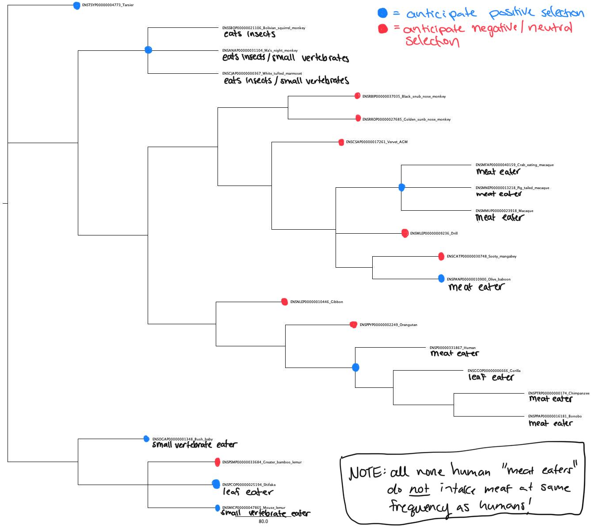

---

---

```{r setup, include=FALSE}
knitr::opts_chunk$set(echo = FALSE)
```

# UMAMI RECEPTOR PROJECT
## INTRODUCTION & PROJECT LIMITATIONS 
During hominin evolution, it has been suggested that the introduction of meat into the hominin diet provided a new, calorically rich food source that resulted in a higher daily caloric intake. Human brains have intense energetic demands (~20-25% of resting metabolic rate) compared to the average primate (~9%) and the average mammal (~3-5%) (Leonard, 2007) and the caloric surplus produced from a dietary transition to regular meat eating may have increased the calories available to allocation to expensive organs, such as the brain. Although humans present an extreme example of brain size, it should be noted that, generally, primates are more encephalized than the average mammal. Indeed, across primates, diet and brain size appear to be tightly linked, although researchers debate the dietary drivers of this increased brain size. Recent work has suggested that frugivorous primates have larger brains (DeCasien, 2017), other work has suggested that lipid dense foods such as nuts may be drivers (Izar, 2022). However, the work from DeCasien et al. explored primates through a predominately through a binary of percent folgivorous diet versus percent frugivorous diet, which is not representative of the heterogeneity of the primate diet and ignores primate participation in meat eating behaviors with humans being the most prolific meat eaters. Some primates are known to eat meat semi-frequently, such as the chimpanzee, baboon and Capuchin, although many primates have been observed with occasional, opportunistic meat eating of small vertebrates such as amphibians, birds and bats (Watts, 2020). Despite the presence of meat eating across primates, its typically occasional and humans appear to be outliers in terms of this behavior. Indeed, early humans appeared to participate in a unique dietary niche of meat exploitation, which may have included not only the intake of animal meat but also bone marrow which is rich in lipids (/ ). 

Both humans and non-human primates incorporate meat into their diet, however, humans 1) participate in meat eating behaviors with more regularity than other primates and 2) participate in specific, extractive behaviors such as 

These two aspects to human meat eating firmly divide ... a different in kind, rather than degree. 

Early humans not only ate meat, but also likely utalized bone marrow which is rich in fat. 

The incorporation of meat in the hominin diet preceded hominin brain expansion (Ferraro, 2013) and, furthermore, other primates such as chimpanzees, bonobos, baboons and capuchins also participate in meat eating behaviors, although not with regularity (Watts, 2020). However, 

**To further evaluate the role of meat in hominin evolution, this first part of this project considers the taste receptors responsible for the transduction of the savory “umami” flavor which is associated with human’s perception of meat.** 


## UMAMI RECEPTOR GENES: HUMANS
1. What evidence suggests links between umami taste receptor genes and dietary transition? 
2. what is the supposed functional change in TAS1R1 and R3 that could confer a fitness advantage related to meat eating, so that selection could act on it? For example, are you hypothesizing that the two receptor proteins evolved a higher binding affinity to their ligands, which may have further driven the organism (hominin) towards meat, because it provides more energy or essential nutrient? is there anything known or can be hypothesized about this?
3. [TAS1R1 and TAS1R3 genes appear to serve several dietary purpose in other primate lineages] so these two receptors are not specific to the unami taste associated with meat. in this case, what's the reason for hypothesizing them being the target of positive selection in the hominids? furthermore, would it alter your hypothesis about which lineages may have experienced selection in these two genes?
5. [Given the suggested importance of meat in the hominin lineage, it logically follows that , if thrue, the receptor cirtical for the transduction of meat flavor would experience selection in teh hominin leage] I have trouble seeing the logic - just because these genes encode taste receptors doesn't mean they are targets of selection. selection act upon fitness differences, mediated by functional changes. what is the supposed functional change that could conceivably be targeted by selection? any circumstantial evidence supporting that?


4. [My hypothesis section] since you have so many hypotheses, it sounds like the first step is to perform an exploratory analysis -- build the gene tree and fit a free-omega branch model to empirically assess the level of variation in dN/dS across lineages. this will help guide your hypothesis building
6. Read and incorporate citations 

Two genes, TAS1R1 and TAS1R3, encode the taste receptors responsible for umami flavor in humans (NOTE: more information concerning the specificity of association between umami and meat will be added for next homework). If a dietary transition towards meat eating was a critical shift in hominin evolution, this may have resulted in positive selection on the TAS1R1 and TAS1R3 genes in the hominin lineage. 

It is important to note, however, that the sole analysis of these umami receptor genes is not sufficient to provide strong support or rejection of the importance of meat in the hominin diet. Rather, the exploration of TAS1R1 and TAS1R3 in this analysis is a "first run" of a larger analysis to be completed in the upcoming summer where a collection of genes related to protein digestion will undergo similar analyses. While its likely the inclusion of additional genes will provide a more complete exploration of human's relationship with meat, these future steps are critical as the TAS1R1 and TAS1R3 genes appear to serve several dietary purposes in other primate lineages beyond simple transduction of umami flavor. 


## UMAMI RECEPTOR GENES: NON-HUMAN PRIMATES 
For example, Todo et al. cloned TAS1R1 receptors of numerous primates across the primate phylogeny and exposed these receptors to L-glutamate (L-glu) and 5'ribonucleotides. They found folivorous primate receptors were responsive to L-glu, which is a prominent component of leaves, and insectivorous primate receptors were responsive to 5' ribonucleotides, which is a prominent component of insects. Interestingly, the receptors of dietary generalists were responsive to both L-glu and 5' ribonucleotides. These researchers identified two amino acid residue mutations which enabled these responsivity differences between folivorous primates and insectivorous primates (Toda, 2021). The strong association of folgivorous diet/L-glu receptor response and insectivorous diet/5' ribonucletide receptor response suggests a shared importance of these receptors across primates as well as emphasizes the receptor's multi-functionality dependent on diet. **Thus, the second part of this project is to examine possible selection on these receptors throughout primates.**

**HYPOTHESES**

Given the suggested importance of meat in the hominin lineage, it logically follows that, if true, the receptors critical for the transduction of meat flavor would experience selection in the hominin lineage: 

**H1: TAS1R1 and/or TAS1R3 will show signatures of positive selection in the human lineage, as determined by comparison of the human foreground branch model results and the null model results via a likelihood ratio test.**

As several other primates also partake in meat eating behaviors, these primates may also show positive selection on either receptor gene:

**H2: Primates known to participate in meat eating behaviors, such as the chimpanzee, will show selection on TAS1R1 and/or TAS1R3, as determined by comparison of the foreground branch model results and the null model results via a likelihood ratio test.**


In the broader primatological context, these receptors appear to serve several dietary functions. For example, the TAS1R1 receptor of dietary specialists, such as fully folivorous or insectivorous primates, demonstrate highly specific and exclusive responses to the molecules that comprise their specialized diets. This, perhaps, suggests heightened importance of these receptors to dietary specialists: 

**H3: TAS1R1 and/or TAS1R3 will show signatures of positive selection in predominately insectivorous primates such as the tarsier, as determined by comparison of the tarsier foreground branch model results and the null model results via a likelihood ratio test.**

**H4: TAS1R1 and/or TAS1R3 will show signatures of positive selection in predominately folivorous primates such as the gorilla, as determined by comparison of the tarsier foreground branch model results and the null model results via a likelihood ratio test.** 

As specific amino acid residues were identified as important in facilitating a strong response to either L-glu or 5'ribonucleotides in Toda et al., I anticipate that the evaluation of these sites will show selection:  

**H5: Both predominately insectivorous primates and predominately folivorous primates will demonstrate selection at the sites 170 and 302 of the TAS1R1 gene, as determined by Bayes Empirical Bayes method.** 


While all above hypotheses have suggested positive selection, its possible that primates with very general diets or perhaps predominately frugivorous diets may not show selection:

**H6: TAS1R1 and/or TAS1R3 will not show signatures of selection in dietary generalists who do not exhibit meat eating behaviors, as determined by comparison of the foreground branch model results and the null model results via a likelihood ratio test.**

# METHODS

## TAS1R1 AND TAS1R3 GENE HISTORY
Both TAS1R1 and TAS1R3 were examined on ensembl.org. For both genes, all primate species had 1:1 orthologue status, meaning only one copy was found in each of species. To further examine the possibility of gene duplication events or any other complexity of gene history confounding analyses of these genes, I separately ran both the TAS1R1 and TAS1R3 human amino acid transcripts through BlastP to check the sequences that returned with high similarity. For both genes, all returning sequences were labeled as the gene of interest. There did not appear to be any other sequences returning. However, some species did have multiple isoforms of the gene. I individually checked each primate from Ensembl.org and some species did have 2-4 known splice variants for either gene, so these results were not surprising.


# COMPLETED METHODS
DNA and amino acid sequence data for the TAS1R1 gene (ENSG00000173662) and the TAS1R3 gene (ENSG00000169962) were gathered from ensembl.org on February 8th, 2023. Ensembl identified 22 species of primates with orthologous sequences for TAS1R1 and 19 species of primates with orthologous sequences for TAS1R3. Both the amino acid sequence and the DNA sequence were downloaded and aligned using muscle. Following this alignment, all gaps in the DNA were checked and manually adjusted based on the amino acid alignment to ensure proper reading frame of codons. The TAS1R1 alignment was noted to be of high quality with only Neumascus leugenys (Gibbon) needing adjustment. The TAS1R3 alignment showed more mutations between species. Particularly, Roxellana bieti (black snub nose monkey) showed numerous insertions and deletions throughout the alignment. Although the subsequent steps were performed with the black snub nose monkey in the TAS1R3 alignment, future re-analyses may remove this species to see if it impacts the results, as this primate appears to be an extreme outlier. Aside from the black snub nose monkey, the TAS1R3 alignment was also of good quality. Following DNA alignment, the alignments for TAS1R1 and TAS1R3 were input in PAUP and both underwent a Maximum Likelihood bootstrap analysis (500 replicates). The resultant trees showed that all primates grouped together based on relatedness for both genes (i.e. New World Monkeys formed a clade, Old World Monkeys formed a clade, etc). The majority of bootstrap values were greater than 95 with the exception of four values for TAS1R1 (52.2, 54, 76.8, and 86.6) and four values for TAS1R3 (58.6, 60.4, 63.8 and 81.6). Additionally, the TAS1R1 and TAS1R3 alignment files were combined then input together into PAUP, where they underwent a Maximum Likelihood bootstrap (500 replicates) as described above. The prosimian TAS1R1 gene was the outgroup. Following this, the TAS1R1 and TAS1R3 genes split and, following this split, both genes grouped via relatedness. These trees can be viewed below. More detailed explanations of these steps were documented in README.md files and can be provided upon request.


# FUTURE METHODS
The tree and alignments will be analyzed in PAML to evaluate possibility of selection. I have spent the last two weeks using example data sets to test proper usage of PAML (general protocols evaluated from Bielawski 2013, Bielawski 2016, and Yang 1997). Additionally, I have begun to draft an R script, which I am currently in the process of editing. I anticipate doing test runs of this script this coming week and troubleshoot arising issues. The goal will be to have a refined script the following week and to use Argon to run my analyses. When I run my analyses, I anticipate using both PAML's branch model and branch site model. PAML's branch model will be used to evaluate possible selection on primate lineages. Each primate species will be treated as the foreground branch in independent runs. Additionally, human and all non-human primate lineages will undergo branch-site model tests. I anticipate results in line with previous hypotheses. 
 

# ANTICIPATED IMAGE 
Following these PAML analyses, I will use R to construct a primate phylogeny which will document type of selection (negative, neutral or positive) on each primate branch (see Image 2 for the image of inspiration). I anticipate importing a phylogenetic tree into R, then I will use packages such as ggtree in R to modify the tree. As in my inspiration image, I anticipate using color coordinated node labels to indicate negative, neutral or positive selection on that branch. This can be done in R. As far as the vertical group labels, I will attempt to find functions in R to acheive this look, although at this moment I am unaware of such functions or aesthetics. However, if I am unable to produce this in R, I will export the image with its colored nodes then make the subsequent additions (the side label groupings) in powerpoint.


# REFERENCES
Bielawski, Joseph P. "Detecting the signatures of adaptive evolution in protein-coding genes." Current protocols in molecular biology. January 15, 2013, 101. DOI: https://doi.org/10.1002/0471142727.mb1901s101.

Bielawski, Joseph P., Jennifer L. Baker, and Joseph Mingrone. “Inference of episodic changes in natural selection acting on protein coding sequences via CODEML.” Current protocols in bioinformatics. June 20, 2016, 54. DOI: https://doi.org/10.1002/cpbi.2.

DeCasien, A. R., Williams, S. A., & Higham, J. P. "Primate brain size is predicted by diet but not sociality." Nature ecology & evolution, 2017, 1(5). DOI: https://doi.org/10.1038/s41559-017-0112. 

Ferraro, Joseph V., Thomas W. Plummer, Briana L. Pobiner, James S. Oliver, Laura C. Bishop, David R. Braun, Peter W. Ditchfield et al. “Earliest archaeological evidence of persistent hominin carnivory.” PloS one 8, April 25, 2013, 4. DOI:10.1371/journal.pone.0062174.

Izar, P., Peternelli-dos-Santos, L., Rothman, J. M., Raubenheimer, D., Presotto, A., Gort, G., ... & Fragaszy, D. M. (2022). "Stone tools improve diet quality in wild monkeys." Current Biology, 2022, 32(18). DOI: https://doi.org/10.1016/j.cub.2022.07.056.

Leonard, William. R., Josh J. Snodgrass, and Marcia L. Robertson. “Effects of brain evolution on human nutrition and metabolism.” Annu. Rev. Nutr, August 21, 2007, 27. DOI: 10.1146/an- nurev.nutr.27.061406.093659.

Toda, Yasuka, et al. "Evolution of the primate gluatamate taste sensor from a nucleotide sensor." Current Biology. October 25, 2021, 31. DOI:https://doi.org/10.1016/j.cub.2021.08.002. 

Watts, David P. "Eating eating by nonhuman primates: A review and synthesis." Journal of Human Evolution. October 24, 2020, 149. DOI:Https://doi.org/10.1016/j.jhevol.2020.102882. 

Wu, Yonghua, Haifeng Wang, Haitao Wang, and Elisabeth A. Hadly. "Rethinking the origin of primates by reconstructing their diel activity patterns using genetics and morphology." Scientific Reports, September 19 2017, 7(1). DOI: https://doi.org/10.1038/s41598-017-12090-3. 

Zhang, Jianzhi. “Parallel Adaptive Origins of Digestive RNases in Asian and African Leaf Monkeys.” Nature Genetics, July 2006, 38(7). DOI: https://doi.org/10.1038/ng1812.

Yang, Ziheng. "PAML: a program package for phylogenetic analysis by Maximum likelihood." Computer applications in the biosciences, October 1, 1997, 13(5). DOI: 10.1093/bioinformatics/13.5.555. 

Yang, Ziheng. “Likelihood Ratio Tests for Detecting Positive Selection and Application to Primate Lysozyme Evolution.” Molecular Biology and Evolution, May 1998, 15(5). https://doi.org/10.1093/oxfordjournals.molbev.a025957.


# APPENDIX 



